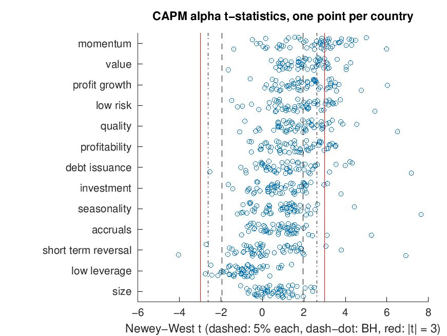

# CAPM tests on international anomaly portfolios (MATLAB)

Tests whether the CAPM explains the returns of anomaly portfolios around the world. The data are the Jensen, Kelly and Pedersen (2023) global factor returns for 13 anomaly themes (momentum, value, quality and so on). In each country, a theme's return is the equal-weighted average of the long-short factors in that theme, each built with capped value weights. The number of factors in a theme grows over time as the data allow. Every country-theme return is regressed on its own country's market excess return. Its alpha is then tested against zero on its own and, with the Gibbons-Ross-Shanken (GRS) test, jointly with the other themes of the same country. The JKP paper asks whether finance has a replication crisis, and one charge is that when hundreds of anomalies are tested, some will look significant by luck. So the last step asks how many of the 694 alphas survive when the number of tests is allowed for: under the usual 5% test, under the Benjamini-Hochberg false discovery rate, under the |t| > 3 hurdle that Harvey, Liu and Zhu (2016) propose for new factors, and under the Bonferroni correction.

## Running it

From this folder, run `get_data` once to download the two data files (about 19 MB) into `data/`, then run `run_capm_tests`. It needs base MATLAB only (the t and F p-values come from `betainc`, so no toolboxes) and also runs in GNU Octave. It prints the output below in a few seconds and saves `alpha_tstats.png`.

| File | What it does |
|---|---|
| `get_data.m` | Downloads and unzips the theme returns and the market excess returns |
| `run_capm_tests.m` | Builds a month × theme × country panel, runs all regressions, GRS tests and multiple-testing corrections, prints the results and draws the figure |
| `capm_alpha.m` | One CAPM regression: alpha, beta and the t-statistic of alpha with Newey-West and OLS standard errors |
| `grs_test.m` | GRS statistic and its p-value |

## Method

- The benchmark is the country's value-weighted market excess return, the market portfolio of the CAPM. The capped weights of the anomaly portfolios keep a few very large stocks from dominating them in small markets. Using the capped market from the same data set instead changes the share of rejections by less than one percentage point.
- A country-theme portfolio is kept if it has at least 60 months with both its own return and the market excess return.
- Each portfolio is regressed as r = α + β·mkt + ε. The test of α = 0 is two-sided at 5% against a t distribution with T − 2 degrees of freedom. The main test uses Newey-West standard errors (Bartlett weights, lag ⌊4(T/100)^(2/9)⌋ from Newey and West, 1994); OLS standard errors are reported as a check. Months missing inside a portfolio's sample count as zeros in the Newey-West sums, so a lag is always measured in calendar months.
- GRS uses the months in which all of a country's kept themes and its market have returns, and needs at least 60 of them (Venezuela has fewer and is left out). A theme that starts late, usually accruals, therefore shortens the whole country's sample. The statistic is W = ((T − N − 1)/N) · α̂′Σ̂⁻¹α̂ / (1 + μ̂²/σ̂²), where Σ̂ and σ̂² are maximum-likelihood estimates, compared with F(N, T − N − 1).
- Four rules decide which of the 694 alphas count as non-zero, from the loosest to the strictest, all with their standard settings. The first is the 5% test on each portfolio, which ignores the number of tests. The second is the Benjamini-Hochberg (1995) procedure applied to all 694 Newey-West p-values at once: sort them, find the largest k with p₍ₖ₎ ≤ k · 0.05 / 694 and reject the k smallest. On average no more than 5% of its rejections are then false. The third is the Harvey, Liu and Zhu (2016) hurdle |t| > 3. The fourth is Bonferroni, p < 0.05 / 694: the chance that any test rejects by luck is at most the sum of the 694 chances, 694 × 0.05 / 694 = 5%.
- The row 'false, expected at most' is the expected number of false rejections if every alpha were zero, so it is an upper bound. For the 5% test it is 0.05 × 694, for the hurdle the sum of P(|t| > 3) under each portfolio's t distribution, and for Bonferroni 0.05. An expected count is a sum of probabilities, so these hold whatever the correlation between the tests. For Benjamini-Hochberg the row shows 5% of its rejections. Its guarantee is about the average share of false rejections, not their number, so this entry is only approximate.

## Results

Data as published in February 2025. The theme returns run to December 2024, but the market excess returns stop in December 2023, so the regressions end there (the US sample starts in 1926). The data are updated from time to time, so a later download can give slightly different numbers.

Output of `run_capm_tests`:

```
694 country-theme portfolios in 54 countries, at least 60 months each
Alpha = 0 rejected at 5%: Newey-West 31.0%, OLS 31.1% (6.2 and 6.2 times chance)
207 of the 215 significant alphas are positive; 52 of 54 countries have at least one
GRS rejects at 5% in 48 of the 53 countries with at least 60 common months, not in
  arg  13 themes  251 months  p = 0.07
  col  13 themes  199 months  p = 0.79
  irl  13 themes  321 months  p = 0.20
  qat  13 themes  188 months  p = 0.12
  vnm  13 themes   82 months  p = 0.22

Countries with a significant Newey-West alpha, by theme (medians across countries)
theme                tested signif mean p.a. alpha p.a.   beta
momentum                 54     35      5.2%       6.3%  -0.13
value                    54     28      4.0%       4.2%   0.01
profit growth            54     27      2.9%       3.0%  -0.02
low risk                 53     24      1.3%       3.2%  -0.25
quality                  54     24      2.9%       3.5%  -0.10
profitability            53     20      2.8%       3.0%  -0.06
debt issuance            53     16      1.6%       1.6%  -0.03
investment               53     11      1.3%       1.6%  -0.04
seasonality              53      8      0.8%       1.1%  -0.02
accruals                 51      6      1.1%       1.6%  -0.02
short term reversal      54      6      0.0%      -0.1%   0.00
low leverage             54      5     -2.0%      -1.9%  -0.05
size                     54      5      1.0%       1.2%  -0.04

Alphas that survive testing all 694 at once (Newey-West t)
theme                tested  5% each  BH 5%  |t|>3 Bonferroni
momentum                 54       35     28     20          7
value                    54       28     18      9          2
profit growth            54       27     15     13          2
low risk                 53       24     14     10          1
quality                  54       24     14      8          2
profitability            53       20     13      8          0
debt issuance            53       16      7      6          3
investment               53       11      3      2          0
seasonality              53        8      3      2          2
accruals                 51        6      2      2          1
short term reversal      54        6      5      4          2
low leverage             54        5      1      0          0
size                     54        5      0      0          0
all                     694      215    123     84         22
  of which positive              207    120     83         21
  false, expected at most       34.7    6.2    2.0       0.05
BH rejects when p <= 0.0089, here |t| >= 2.63
```



The dashed lines mark the 5% test, the dash-dot lines the Benjamini-Hochberg cut-off and the red lines |t| = 3.

## Why the results come out this way

- **The rejections are not chance.** If the CAPM held, about 5% of alphas would be significant by luck, split evenly between positive and negative. Instead 31% are significant and 207 of the 215 are positive, the direction in which each factor is signed. Five of the eight negative ones are in low leverage, the only theme with a clearly negative median alpha.
- **For most themes alpha is close to the mean return.** Alpha is the mean minus β times the market's mean, and a long-short portfolio holds stocks on both sides, so its beta is close to zero. Low risk is the exception: it buys low-beta stocks and sells high-beta ones, so its median beta is -0.25 and the CAPM predicts a negative mean. It earns 1.3% a year instead, an alpha of 3.2% (the 'betting against beta' result of Frazzini and Pedersen, 2014).
- **Four themes are close to chance.** Accruals, short-term reversal, low leverage and size have a significant alpha in only 5 or 6 of 51 to 54 countries, against about 3 expected by luck. The evidence against the CAPM comes from the themes at the top of the table, not from all of them.
- **Newey-West hardly changes the count.** It allows for heteroskedastic and autocorrelated residuals and moves individual t-statistics, but the share of rejections is almost the same as with OLS (31.0% against 31.1%). The result does not depend on assuming independent, equal-variance errors.
- **GRS is the stricter test.** With 13 themes, at least one would look significant by luck in about half of countries (1 − 0.95¹³ ≈ 49%), so one significant theme says little about a country. GRS tests all themes at once, allowing for their correlations, and rejects in 48 of the 53 countries it can test. Of the five where it does not, Argentina, Colombia, Ireland and Qatar are small markets (21 to 65 stocks at the end of 2023), and Vietnam has only 82 common months. The test has little power there, so not rejecting is not evidence that the CAPM holds.
- **Most of the 215 are real, but only some can be named.** Luck alone would on average produce at most 35 rejections at 5% (0.05 × 694), so most of the 215 reflect real alphas. The 5% test cannot say which ones; the stricter rules keep those that luck explains least well. Benjamini-Hochberg keeps 123, of which about 6 may be false. The |t| > 3 hurdle keeps 84, with at most 2 false ones expected. Bonferroni keeps 22, with at most a 5% chance that even one is false. The survivors are almost all positive (120 of 123, 83 of 84 and 21 of 22), whereas false rejections would split evenly between the two signs. This agrees with JKP, who argue with a Bayesian model that most factors replicate and that the large number of factors does not weaken the evidence.
- **The Benjamini-Hochberg cut-off is itself evidence.** The cut-off is k · 0.05 / 694, so it depends on how many p-values are small. If only one were, it would be 0.05 / 694 ≈ 0.00007, the Bonferroni cut-off, about |t| > 4. Because 123 are small, it relaxes to 123 · 0.05 / 694 ≈ 0.0089, here |t| ≥ 2.63. If the alphas were luck, the cut-off would stay near |t| = 4 and almost nothing would pass it.
- **The corrections remove the weak themes, not the strong ones.** Momentum keeps 28 of its 35 rejections under Benjamini-Hochberg, 20 under |t| > 3 and 7 under Bonferroni, the most of any theme. Size and low leverage, whose 5 rejections each are close to the 2.7 (0.05 × 54) that luck gives, keep none and one under Benjamini-Hochberg and none under the stricter rules. A stricter cut-off removes t-statistics just above 1.96, and those are most common in themes whose true alphas are small or zero.
- **Short-term reversal is the exception.** Its median alpha is about zero, yet 5 of its 6 rejections survive Benjamini-Hochberg. The figure shows why: its large t-statistics lie on both sides of zero, so the anomaly works strongly in some markets and goes the other way in others, and the median hides both.
- **|t| > 3 is stricter than Benjamini-Hochberg here, and that has a cost.** Harvey, Liu and Zhu chose 3 for factors found by searching hundreds of US candidates, and the hurdle does not adapt to the data. Since t ≈ annual Sharpe ratio × √years, an anomaly with an annual Sharpe ratio of 0.5 needs about 36 years of data to clear 3 but only 15 to clear 1.96, so the hurdle misses true effects in short samples. A US anomaly tested in another country is also a test of an idea fixed in advance, not a new search, so the hurdle is arguably too harsh outside the US.

## Limitations

- Benjamini-Hochberg keeps its 5% guarantee only if the tests are independent or positively correlated. Anomaly returns are correlated within a country and, for the same theme, across countries, mostly but not always positively (value and momentum, for example, are negatively correlated in most markets, as Asness, Moskowitz and Pedersen, 2013, show). The other three rules need no such assumption, so the bounds of 2.0 false rejections for |t| > 3 and 0.05 for Bonferroni hold here too. Correlation does make the actual number of false rejections more variable than its expected value.
- The 694 tests are not all the tests behind these themes. JKP built the themes from factors that earlier research found mostly in US data, and those earlier searches are not counted here.
- The benchmark is the CAPM only. The counts say how many anomaly portfolios the CAPM fails to price, not how many are distinct from one another or from other factors.

## References

- Asness, C. S., Moskowitz, T. J. and Pedersen, L. H. (2013). Value and momentum everywhere. *Journal of Finance*, 68(3), 929–985.
- Benjamini, Y. and Hochberg, Y. (1995). Controlling the false discovery rate: a practical and powerful approach to multiple testing. *Journal of the Royal Statistical Society, Series B*, 57(1), 289–300.
- Frazzini, A. and Pedersen, L. H. (2014). Betting against beta. *Journal of Financial Economics*, 111(1), 1–25.
- Gibbons, M., Ross, S. and Shanken, J. (1989). A test of the efficiency of a given portfolio. *Econometrica*, 57(5), 1121–1152.
- Harvey, C. R., Liu, Y. and Zhu, H. (2016). … and the cross-section of expected returns. *Review of Financial Studies*, 29(1), 5–68.
- Jensen, T. I., Kelly, B. and Pedersen, L. H. (2023). Is there a replication crisis in finance? *Journal of Finance*, 78(5), 2465–2518. Data from [jkpfactors.com](https://jkpfactors.com).
- Newey, W. and West, K. (1987). A simple, positive semi-definite, heteroskedasticity and autocorrelation consistent covariance matrix. *Econometrica*, 55(3), 703–708.
- Newey, W. and West, K. (1994). Automatic lag selection in covariance matrix estimation. *Review of Economic Studies*, 61(4), 631–653.
