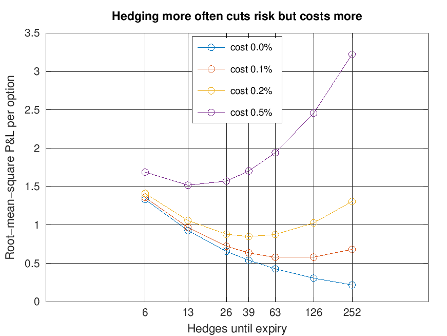
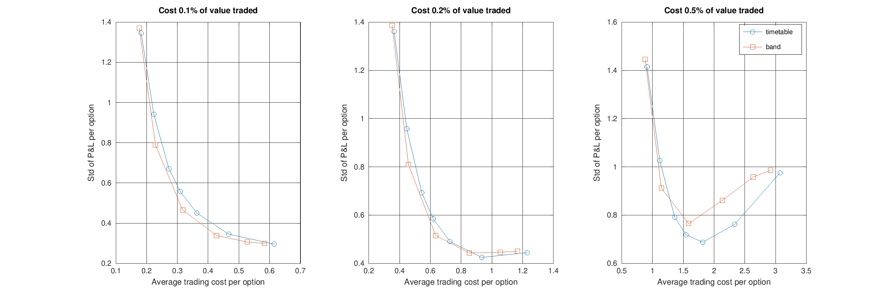

# Delta-hedging simulator (MATLAB)

Sells a European call option and delta-hedges it until expiry over 50,000 simulated stock paths. It measures how four things drive the hedged profit and loss (P&L):

1. how often the hedge is rebalanced,
2. selling the option at a volatility different from the one the stock then realises,
3. trading costs, and
4. rebalancing when the position needs it, i.e. when the share holding has drifted a set distance from delta, instead of on a fixed timetable.

## Running it

Open MATLAB in this folder and run `run_experiments`. With GNU Octave, run this from the folder (the two settings save the figures without opening a plot window):

```
octave-cli --no-gui -q --eval "graphics_toolkit('gnuplot'); set(0,'defaultfigurevisible','off'); run_experiments"
```

It needs base MATLAB only (no toolboxes), prints the tables below and saves two figures to `figures/` in about a minute.

| File | What it does |
|---|---|
| `run_experiments.m` | Sets the parameters, runs the four experiments, prints the tables and saves the figures |
| `simulate_hedge.m` | Simulates stock paths (geometric Brownian motion) and the hedge: sells the call at implied volatility, buys the delta in shares, rebalances at the end of every interval (or, given a band, only where the holding is at least the band away from delta), unwinds at expiry and pays the payoff. Returns P&L, trading costs and number of hedges per path |
| `bs_call.m` | Black-Scholes call price, delta and vega |

## Set-up

A three-month at-the-money call (S0 = K = 100) is sold at 20% implied volatility with a 3% risk-free rate, for a premium of 4.358 (vega 19.79 per unit of volatility, so 0.198 per volatility point). The stock follows geometric Brownian motion with an 8% drift, and cash earns the risk-free rate. P&L is per option, in today's money.

Every simulation restarts the random number generator from the same seed, so strategies with the same number of hedges are compared on the same stock paths. The one exception is a check on fresh paths at the end of experiment 4. The numbers below come from GNU Octave 8.4; MATLAB's generator gives slightly different values.

## 1. How often to hedge

Realised volatility equals implied volatility and there are no trading costs, so the only source of P&L is hedging at discrete times instead of continuously.

| Hedging | Hedges | Mean P&L | Std of P&L | Derman-Kamal approximation | Skewness |
|---|---:|---:|---:|---:|---:|
| fortnightly | 6 | -0.011 | 1.332 | 1.432 | -0.55 |
| weekly | 13 | -0.002 | 0.928 | 0.973 | -0.41 |
| twice weekly | 26 | 0.002 | 0.656 | 0.688 | -0.29 |
| 3x weekly | 39 | 0.002 | 0.541 | 0.562 | -0.25 |
| daily | 63 | 0.000 | 0.429 | 0.442 | -0.19 |
| twice daily | 126 | -0.001 | 0.307 | 0.313 | -0.16 |
| 4x daily | 252 | 0.001 | 0.219 | 0.221 | -0.11 |

- **Mean P&L is zero.** The premium pays for the hedge.
- **The spread falls like 1/√N.** Hedging four times as often halves the standard deviation, and the fitted slope of log(std) on log(N) is -0.484, against -0.5 in theory.
  - Over one interval the short hedged call earns about ½ Γ S² [σ²Δt − (ΔS/S)²]. This is zero on average, with a variance proportional to Δt².
  - Adding up N = T/Δt of these gives a variance proportional to Δt, so the standard deviation scales with √(T/N).
- **The Derman-Kamal approximation fits once hedging is frequent.** √(π/4) σ × vega / √N is 1–4% above the simulation from three hedges a week upwards and 5–7.5% above for less frequent hedging. It assumes each interval is short; over a long interval the stock can move away from the strike, where gamma is smaller, so the approximation overstates the error.
- **The P&L is skewed to the left.** Each interval's P&L is at most ½ Γ S² σ² Δt but can be large and negative after a big move, because a short option is short gamma. The skew fades from -0.55 to -0.11 as hedging becomes more frequent, because the P&L is then the sum of more, smaller errors.

## 2. Selling at the wrong volatility

The call is still sold at 20%, but the stock realises between 10% and 30%. The hedge is rebalanced daily, using the delta at either the implied or the realised volatility, on the same stock paths.

| Realised vol | C(implied) − C(realised) | Implied-vol delta: mean | std | Realised-vol delta: mean | std |
|---:|---:|---:|---:|---:|---:|
| 10% | 1.975 | 1.938 | 0.546 | 1.973 | 0.210 |
| 15% | 0.989 | 0.980 | 0.453 | 0.988 | 0.320 |
| 20% | 0.000 | 0.000 | 0.429 | 0.000 | 0.429 |
| 25% | -0.990 | -0.987 | 0.679 | -0.989 | 0.538 |
| 30% | -1.980 | -1.976 | 1.107 | -1.979 | 0.647 |

- **The realised-volatility delta locks in the price difference.** It replicates a call priced at the realised volatility, so the P&L is C(20%) − C(σ_real) whatever the drift, apart from discrete-hedging noise (std 0.21 at 10% realised volatility). Selling at 20% when the stock realises 15% makes 0.99 per option.
- **The implied-volatility delta makes the profit path-dependent.** The profit builds up as ½ Γ S² (σ_imp² − σ_real²) dt, so it depends on how long the stock spends near the strike, where gamma is largest (std 0.55 at 10% realised volatility).
- **Its mean also picks up the stock's drift.** The implied-volatility delta is not the exact replicating hedge, so part of the stock's 8% drift leaks into the P&L: at 10% realised volatility the mean is 1.938 against 1.975. Setting `p.mu = p.r` removes the gap.
- **Hedging at implied volatility still has a use.** Realised volatility is unknown in advance, and the implied-volatility delta keeps the mark-to-market P&L smooth, at the cost of path dependence (Ahmad and Wilmott, 2005).

## 3. Trading costs

Each trade, including the first hedge and the final unwind, costs a fixed fraction of the value traded. Root-mean-square P&L, √(mean² + variance), counts a predictable average cost and an unpredictable spread on the same scale, so lower is better.

| Hedging | Hedges | No costs | 0.1% | 0.2% | 0.5% |
|---|---:|---:|---:|---:|---:|
| fortnightly | 6 | 1.332 | 1.359 | 1.411 | 1.689 |
| weekly | 13 | 0.928 | 0.968 | 1.058 | 1.519 |
| twice weekly | 26 | 0.656 | 0.724 | 0.880 | 1.574 |
| 3x weekly | 39 | 0.541 | 0.637 | 0.850 | 1.704 |
| daily | 63 | 0.429 | 0.579 | 0.877 | 1.942 |
| twice daily | 126 | 0.307 | 0.582 | 1.027 | 2.458 |
| 4x daily | 252 | 0.219 | 0.682 | 1.307 | 3.224 |



- **Costs rise as hedging error falls.** Hedging error falls like 1/√N. Each rebalance trades roughly Γ S σ √Δt shares, so the cost of rebalancing grows like √N, on top of the fixed cost of setting up and unwinding the hedge.
- **The best frequency falls as costs rise.** At 0.1%, daily and twice daily are about 0.5% apart, which is within simulation noise (other seeds favour either); at 0.2%, three times a week (0.850, against 0.877 daily); at 0.5%, weekly. Leland (1985) builds the expected cost into the price by raising the volatility used in Black-Scholes.

## 4. Hedging when the position needs it

A timetable rebalances whether or not the hedge has drifted. The alternative here checks the position four times a day, on the same stock paths as 4x daily hedging, and trades back to delta only when the share holding is at least a set band away from it. The six bands (0.01 to 0.32 shares per option, doubling each time) and the check frequency were fixed before any results were seen. The trading costs are those of experiment 3. The three-times-a-week timetable was added after a first run, because the best timetable at 0.2% fell in the wide gap between twice weekly and daily. Adding it makes the timetable harder to beat. Hedges count the initial hedge and every rebalance, averaged over paths for the band rule.

| Rule | Hedges | No cost: std | 0.1%: cost | std | 0.2%: cost | std | 0.5%: cost | std |
|---|---:|---:|---:|---:|---:|---:|---:|---:|
| fortnightly | 6 | 1.332 | 0.182 | 1.345 | 0.365 | 1.360 | 0.912 | 1.414 |
| weekly | 13 | 0.928 | 0.224 | 0.941 | 0.447 | 0.958 | 1.118 | 1.026 |
| twice weekly | 26 | 0.656 | 0.272 | 0.671 | 0.545 | 0.693 | 1.362 | 0.791 |
| 3x weekly | 39 | 0.541 | 0.309 | 0.558 | 0.619 | 0.585 | 1.547 | 0.719 |
| daily | 63 | 0.429 | 0.363 | 0.451 | 0.727 | 0.491 | 1.817 | 0.688 |
| twice daily | 126 | 0.307 | 0.467 | 0.346 | 0.934 | 0.425 | 2.336 | 0.762 |
| 4x daily | 252 | 0.219 | 0.615 | 0.296 | 1.229 | 0.445 | 3.073 | 0.975 |
| band 0.01 | 149.2 | 0.222 | 0.583 | 0.300 | 1.167 | 0.450 | 2.917 | 0.986 |
| band 0.02 | 101.1 | 0.235 | 0.528 | 0.306 | 1.055 | 0.447 | 2.638 | 0.958 |
| band 0.04 | 51.5 | 0.289 | 0.427 | 0.339 | 0.855 | 0.443 | 2.136 | 0.861 |
| band 0.08 | 20.6 | 0.442 | 0.317 | 0.465 | 0.635 | 0.516 | 1.587 | 0.765 |
| band 0.16 | 7.3 | 0.777 | 0.229 | 0.789 | 0.458 | 0.809 | 1.145 | 0.912 |
| band 0.32 | 2.7 | 1.357 | 0.176 | 1.370 | 0.352 | 1.386 | 0.881 | 1.445 |



- **With low costs the band rule gives less spread for the same cost.** At 0.1% its curve lies below the timetable's in the middle of the range. A 0.04 band costs less than twice-daily hedging (0.427 against 0.467) and leaves less spread (0.339 against 0.346). A 0.16 band costs about the same as weekly hedging (0.229 against 0.224) and leaves 16% less spread (0.789 against 0.941). At the ends the two rules meet. A 0.01 band makes 149 hedges on average and ends up close to 4x daily hedging. A 0.32 band rebalances fewer than twice after the initial hedge, like fortnightly hedging.
- **It removes hedging error more cheaply because it trades only when the hedge is off.** If the stock is up at one rebalancing date and back down by the next, a timetable buys and then sells, paying twice to end where it started. The band rule ignores moves that stay inside the band. It spends its trades where delta moves most: near the strike and close to expiry, where gamma is large. Without costs, a 0.04 band leaves a std of 0.289 with 51.5 hedges on average, against 0.429 with 63 daily hedges.
- **But it makes the trading bill itself uncertain.** A timetable makes the same number of trades on every path. The band rule trades often on paths where delta keeps moving, such as a stock that stays near the strike close to expiry, and rarely on paths that drift away from the strike. P&L with costs is P&L without costs minus the trading bill, so a bill that varies from path to path adds to the spread, and more so the higher the cost rate. From no costs to 0.5%, the std of the 0.04 band rises from 0.289 to 0.861. Over the same range, twice-daily hedging pays more on average (2.336 against 2.136), but its std rises only from 0.307 to 0.762.
- **So the band rule's edge shrinks as costs rise.** At 0.2% the 0.08 and 0.16 bands still beat the timetable at the same cost: a 0.08 band costs 0.635 for a std of 0.516, against 0.619 for 0.585 hedging three times a week. The narrow bands are worse: a 0.02 band costs 1.055 for a std of 0.447, against 0.934 for 0.425 hedging twice daily. At 0.5% only the 0.16 band clearly beats the timetable, at 1.145 and 0.912 against 1.118 and 1.026 for weekly hedging.

The run then picks the band and the timetable with the lowest root-mean-square P&L at each cost level, and re-scores both on 50,000 fresh paths (seed 2). The mean P&L is close to minus the average cost, so the RMS is roughly the distance from the origin in the figure. The gain is how much lower the band's RMS is than the timetable's.

| Cost | Best band | RMS | Fresh paths | Best timetable | RMS | Fresh paths | Gain | Fresh paths |
|---:|---:|---:|---:|---|---:|---:|---:|---:|
| 0.1% | 0.04 | 0.546 | 0.544 | daily | 0.579 | 0.579 | 5.6% | 5.9% |
| 0.2% | 0.08 | 0.820 | 0.820 | 3x weekly | 0.850 | 0.857 | 3.6% | 4.3% |
| 0.5% | 0.16 | 1.474 | 1.481 | weekly | 1.519 | 1.515 | 3.0% | 2.3% |

- **On RMS P&L the band rule wins at every cost level, by a few per cent.** In each case the best band pays a little more in costs than the best timetable but leaves clearly less spread. For example, at 0.1% the 0.04 band costs 0.427 with a std of 0.339, against 0.363 and 0.451 for daily hedging.
- **The gain survives on fresh paths.** Picking the best of six bands and the best of seven timetables on the same paths that score them flatters both. On fresh paths each gain moves by less than a percentage point. It is largest at the lowest cost (5.9%) and smallest at the highest (2.3%).

## Limitations

- The model is Black-Scholes with known volatility: no jumps, no volatility changes, and only a proportional trading cost, with no fixed fee per trade. All the results are for one option, a three-month at-the-money call at 20% volatility.
- The band is a fixed number of shares everywhere. Whalley and Wilmott (1997) derive a band whose width depends on gamma and the cost rate, and trade only back to the edge of the band rather than to delta. Neither is tried here.
- The position is checked four times a day, so with narrow bands the holding can move well past the band between checks. Continuous monitoring would keep it closer.
- Both rules are tried on coarse grids, with each step roughly doubling the bands or the number of hedges. So the best setting of each is found only roughly, and finer grids could move the gains by about a percentage point.

## References

- Derman, E. and Kamal, M. (1999). When you cannot hedge continuously: the corrections of Black-Scholes. *Risk*.
- Ahmad, R. and Wilmott, P. (2005). Which free lunch would you like today, Sir? Delta hedging, volatility arbitrage and optimal portfolios. *Wilmott Magazine*.
- Leland, H. E. (1985). Option pricing and replication with transactions costs. *Journal of Finance*, 40(5), 1283–1301.
- Whalley, A. E. and Wilmott, P. (1997). An asymptotic analysis of an optimal hedging model for option pricing with transaction costs. *Mathematical Finance*, 7(3), 307–324.
