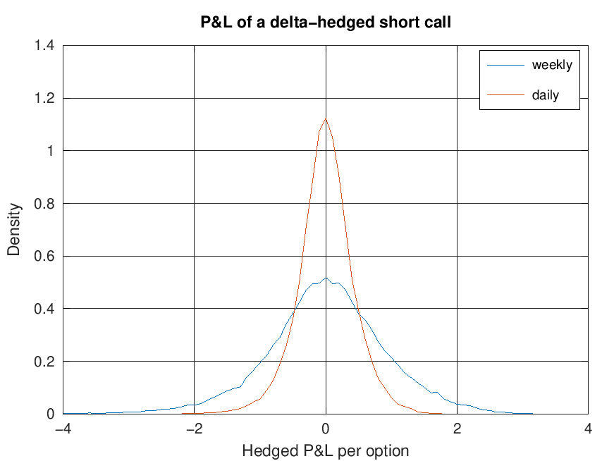
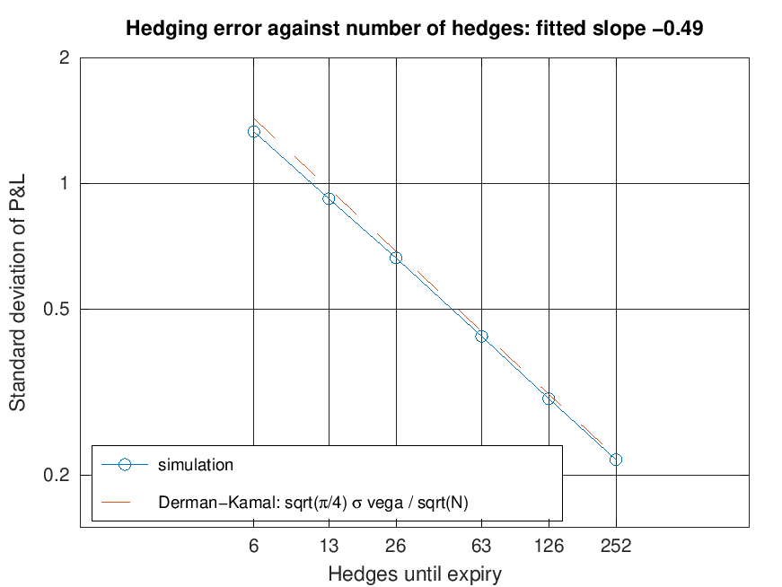
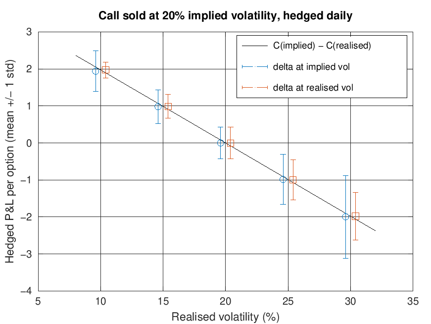

# Delta-hedging simulator (MATLAB)

Sells a European call option and delta-hedges it until expiry over thousands of simulated stock paths. It measures how three things drive the hedged profit and loss (P&L):

1. how often the hedge is rebalanced,
2. selling the option at a volatility different from the one the stock then realises, and
3. trading costs.

## Running it

Open MATLAB in this folder and run `run_experiments`. It needs base MATLAB only (no toolboxes) and also runs in GNU Octave. It prints three tables and saves four figures to `figures/` in under a minute.

| File | What it does |
|---|---|
| `run_experiments.m` | Sets the parameters, runs the three experiments, prints the tables and saves the figures |
| `simulate_hedge.m` | Simulates stock paths (geometric Brownian motion) and the hedge: sells the call at implied volatility, buys the delta in shares, rebalances at the end of every interval, unwinds at expiry and pays the payoff. Returns P&L per path |
| `bs_call.m` | Black-Scholes call price, delta, gamma and vega |

## Set-up

A three-month at-the-money call (S0 = K = 100) is sold at 20% implied volatility with a 3% risk-free rate, for a premium of 4.358 (vega 19.79). The stock follows geometric Brownian motion with an 8% drift, and cash earns the risk-free rate. P&L is per option, in today's money, over 50,000 paths.

The numbers below come from one run in GNU Octave. Another run, or MATLAB, gives slightly different values, and MATLAB's figures look a little different.

## 1. How often to hedge

Realised volatility equals implied volatility and there are no trading costs, so the only source of P&L is hedging at discrete times instead of continuously.

| Hedging | Hedges | Mean P&L | Std of P&L | Derman-Kamal approximation |
|---|---:|---:|---:|---:|
| fortnightly | 6 | -0.011 | 1.332 | 1.432 |
| weekly | 13 | 0.004 | 0.919 | 0.973 |
| twice weekly | 26 | 0.003 | 0.663 | 0.688 |
| daily | 63 | -0.001 | 0.430 | 0.442 |
| twice daily | 126 | 0.001 | 0.305 | 0.313 |
| 4x daily | 252 | -0.000 | 0.218 | 0.221 |

- **Mean P&L is zero.** The premium pays for the hedge.
- **The spread falls like 1/√N.** Hedging four times as often halves the standard deviation, and the fitted slope of log(std) on log(N) is -0.485, against -0.5 in theory.
  - Over one interval the hedge leaves an error of about ½ Γ S² [(ΔS/S)² − σ²Δt]. It is zero on average, with a variance proportional to Δt².
  - Adding up N = T/Δt of these gives a variance proportional to Δt, so the standard deviation scales with √(T/N).
- **The Derman-Kamal approximation fits.** √(π/4) σ × vega / √N is within 4% of the simulation from twice-weekly hedging upwards. It is 6–8% too high for weekly and fortnightly hedging, where the steps are too large for the approximation.
- **The P&L is skewed to the left** (skewness -0.35 weekly, -0.22 daily). A short option is short gamma, so large moves lose money.

## 2. Selling at the wrong volatility

The call is still sold at 20%, but the stock realises between 10% and 30%. The hedge is rebalanced daily, using the delta at either the implied or the realised volatility.

| Realised vol | C(implied) − C(realised) | Implied-vol delta: mean | std | Realised-vol delta: mean | std |
|---:|---:|---:|---:|---:|---:|
| 10% | 1.975 | 1.940 | 0.549 | 1.973 | 0.211 |
| 15% | 0.989 | 0.981 | 0.453 | 0.986 | 0.320 |
| 20% | 0.000 | 0.000 | 0.433 | -0.002 | 0.430 |
| 25% | -0.990 | -0.984 | 0.679 | -0.995 | 0.542 |
| 30% | -1.980 | -1.994 | 1.118 | -1.980 | 0.646 |

- **Either delta earns about the price difference on average.** That difference is between the Black-Scholes prices at the two volatilities. Selling at 20% when the stock realises 15% makes about 0.99 per option.
- **The choice of delta changes the risk.**
  - With the realised-volatility delta, the profit is locked in apart from discrete-hedging noise (std 0.21 at 10% realised volatility).
  - With the implied-volatility delta, the profit builds up as ½ Γ S² (σ²implied − σ²realised) dt. It depends on how long the stock spends near the strike, where gamma is largest (std 0.55).
- **Desks hedge at implied volatility anyway.** Nobody knows realised volatility in advance, so they accept the path dependence (Ahmad and Wilmott, 2005).

## 3. Trading costs

Each trade, including the first hedge and the final unwind, costs a fixed fraction of the value traded. Root-mean-square P&L combines the average cost with the spread, so lower is better.

| Hedging | Hedges | No costs | 0.1% | 0.2% | 0.5% |
|---|---:|---:|---:|---:|---:|
| fortnightly | 6 | 1.319 | 1.353 | 1.416 | 1.679 |
| weekly | 13 | 0.919 | 0.960 | 1.052 | 1.502 |
| twice weekly | 26 | 0.661 | 0.733 | 0.887 | 1.578 |
| daily | 63 | 0.430 | 0.582 | 0.883 | 1.947 |
| twice daily | 126 | 0.308 | 0.578 | 1.026 | 2.464 |
| 4x daily | 252 | 0.218 | 0.679 | 1.310 | 3.231 |

- **Costs rise as hedging error falls.** Hedging error falls like 1/√N. Each rebalance trades roughly Γ S σ √Δt shares, so the total traded, and the cost, grows like √N.
- **The best frequency falls as costs rise.** At 0.1% it is daily or twice daily (within 1% of each other); at 0.2%, twice weekly or daily; at 0.5%, weekly. Leland (1985) studies the same trade-off.

## Things to try next

- **Change the drift `p.mu`.** The average P&L barely moves, because the hedge removes exposure to the stock's direction. The spread changes a little, because the drift changes how long the stock spends near the strike.
- **Try other options.** Hedge a put or an out-of-the-money option, and compare its hedging error with the at-the-money call's.
- **Add jumps or stochastic volatility.** See how much hedging error is left even when hedging very often.
- **Gamma-hedge with a second option.** Measure how much of the remaining error goes away.
- **Use Leland's cost-adjusted volatility for the hedge.** Compare the costs.
- **Use common random numbers.** Run every scenario on the same random draws, so differences between scenarios are less noisy.

## References

- Derman, E. and Kamal, M. (1999). When you cannot hedge continuously: the corrections of Black-Scholes. *Risk*.
- Ahmad, R. and Wilmott, P. (2005). Which free lunch would you like today, Sir? Delta hedging, volatility arbitrage and optimal portfolios. *Wilmott Magazine*.
- Leland, H. E. (1985). Option pricing and replication with transactions costs. *Journal of Finance*, 40(5), 1283–1301.
