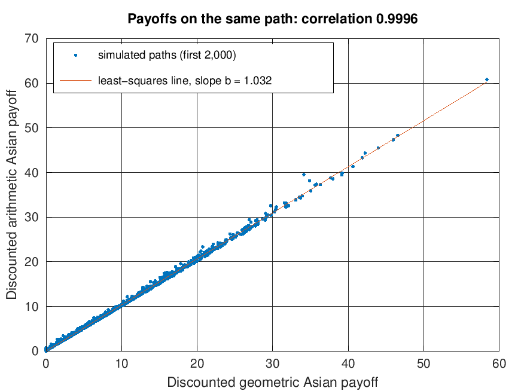

# Monte Carlo pricing of Asian options (MATLAB)

Prices a discretely monitored arithmetic-average Asian call by Monte Carlo under risk-neutral geometric Brownian motion. The option has no closed form, so the project compares four estimators of its price at the same number of paths: plain Monte Carlo, antithetic variates, a geometric Asian control variate, and the control variate combined with antithetic variates. A European call and a geometric-average Asian call, both of which have closed forms, check the simulated paths and the known mean that the control variate relies on.

## Running it

Open MATLAB in this folder and run `run_pricing`. It needs base MATLAB only (no toolboxes) and also runs in GNU Octave:

```
octave-cli --no-gui -q --eval "graphics_toolkit('gnuplot'); set(0,'defaultfigurevisible','off'); run_pricing"
```

It prints the two tables below and saves `payoff_scatter.png`.

| File | What it does |
|---|---|
| `run_pricing.m` | Sets the parameters, computes the closed forms, runs the estimators, prints the tables and saves the figure |
| `simulate_payoffs.m` | Simulates price paths at the averaging dates and returns the discounted European, arithmetic Asian and geometric Asian payoffs |
| `black_call.m` | Black's formula, used for both closed forms |

## Set-up

S0 = 100, K = 100, r = 5%, σ = 20%, T = 1 year, with 12 monthly averaging dates t_i = iΔt (the last at expiry). Each method uses 100,000 paths; the antithetic methods use 50,000 pairs, so every row of the second table costs the same number of paths. The variance ratio is (SE of plain Monte Carlo / SE of the method)², the number of times as many plain paths needed for the same standard error.

The closed forms both use Black's formula, because S_T and the geometric average G are both lognormal:

- **European call:** forward S0·e^(rT), log-variance σ²T.
- **Geometric Asian call** (discrete version of Kemna and Vorst, 1990): ln G is normal with mean m = ln S0 + (r − σ²/2)Δt(n+1)/2 and variance v = σ²Δt(n+1)(2n+1)/(6n), so the forward is e^(m + v/2). The variance follows from Var(Σ W(t_i)) = Δt Σ_i Σ_j min(i, j) = Δt n(n+1)(2n+1)/6.

The numbers below come from one run in GNU Octave 8.4 with seed 1. MATLAB's random number stream differs from Octave's, so it gives slightly different numbers.

## Results

Closed-form checks, plain Monte Carlo with 100,000 paths (z = (Monte Carlo − closed form) / std error):

| Option | Monte Carlo | Std error | Closed form | z |
|---|---:|---:|---:|---:|
| European call | 10.5101 | 0.0468 | 10.4506 | 1.27 |
| Geometric Asian call | 5.9796 | 0.0261 | 5.9402 | 1.51 |

Arithmetic Asian call, 100,000 paths per method:

| Method | Price | Std error | Variance ratio |
|---|---:|---:|---:|
| Plain | 6.1972 | 0.02697 | 1 |
| Antithetic | 6.1380 | 0.01855 | 2 |
| Control variate | 6.1566 | 0.00076 | 1276 |
| Control variate + antithetic | 6.1548 | 0.00079 | 1170 |

Control-variate coefficient b = 1.0317 (single paths) and 1.0275 (antithetic pairs). Correlation between the arithmetic and geometric payoffs: 0.999608. Correlation between antithetic partners: −0.521 for the arithmetic payoff, +0.070 for the control-variate residual.



- **The closed-form checks pass.** Both simulated prices are within 1.6 standard errors of the exact value. The two errors are not independent: both prices come from the same paths, and a path that pays well on the European call tends to pay well on the geometric Asian too.
- **The control variate removes almost all the noise.** On every path the arithmetic average A is at least the geometric average G, and with monthly averaging and 20% volatility the gap is small, so the two payoffs lie almost on a line (figure). The estimator averages Y − b(X − E[X]), where Y is the arithmetic payoff and X the geometric one. With the optimal b = cov(Y, X)/var(X), its variance is (1 − ρ²) var(Y), so the variance ratio is 1/(1 − ρ²). With ρ = 0.999608 that is 1276, as in the table, and the standard error falls by 97%. Only the part of the arithmetic payoff that the geometric payoff does not explain is left to simulate.
- **Antithetic variates help less.** Pairing each path with its mirror image (Z and −Z) helps only as far as the two payoffs move in opposite directions: the variance per path is multiplied by 1 + ρ_pair, where ρ_pair is the correlation between partners. A call pays nothing on over 40% of paths, so ρ_pair is only −0.521 and the variance ratio is about 2.
- **Adding antithetic variates to the control variate does not help.** The control variate has already removed the part of the payoff that depends on the direction of the path, which is the part antithetic pairs cancel. What is left depends mostly on how far prices spread out along the path, which is about the same for a path and its mirror image, so the partners' residuals are slightly positively correlated (+0.070). The variance ratio falls from 1276 to 1170.
- **The only bias comes from estimating b.** The log-price is simulated exactly at the averaging dates, so 12 steps per path give no discretisation bias. Estimating b from the same paths adds a bias of order 1/N, far below the standard error.

## References

- Kemna, A. G. Z. and Vorst, A. C. F. (1990). A pricing method for options based on average asset values. *Journal of Banking and Finance*, 14(1), 113–129.
- Glasserman, P. (2004). *Monte Carlo Methods in Financial Engineering*. Springer.
