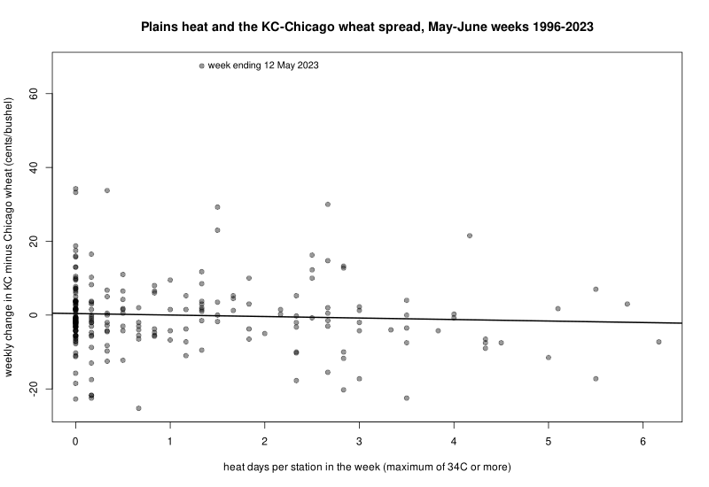

# Plains heat and the KC–Chicago wheat spread (R)

Hard red winter wheat, traded in Kansas City (KC), grows on the southern Plains; soft red winter wheat, traded in Chicago, grows further east. Heat during heading and grain fill cuts Plains yields but not eastern ones, so a hot week on the Plains should raise KC wheat against Chicago wheat, while news that moves all wheat (the dollar, Black Sea exports, fund flows) cancels out in the spread between them. This project counts hot days at six weather stations across the hard-wheat belt and asks three questions: does the KC–Chicago spread respond to the heat, does it move before, during or after it, and could a trader reading the stations profit after costs? The hypothesis, the trading rule and its parameters were written down before any returns were looked at. The months after harvest serve as a placebo, since heat then should no longer matter for wheat.

## Running it

From this folder, run `Rscript get_data.R` once to download the price and weather files (about 16 MB) into `data/`, then `Rscript weather_spread.R`. It prints the output below in about ten seconds and saves `heat_vs_spread.png`. `Rscript check_alignment.R` prints the data check described under Data. Base R only (tested with R 4.3).

| File | What it does |
|---|---|
| `get_data.R` | Downloads the KC and Chicago futures files and six NOAA station records |
| `closes.R` | Daily close of every contract month in a futures file |
| `weather_spread.R` | Builds the weekly spread and heat series, runs the regressions and the trading rule, prints the results and draws the figure |
| `check_alignment.R` | Shows that the KC file's end-of-day prices run a day behind Chicago in 2009–2020 |

## Data

- **Futures prices**: daily prices of individual contracts from Robert Carver's open-source [pysystemtrade](https://github.com/robcarver17/pysystemtrade) (GPL-3.0), files `data/futures/multiple_prices_csv/REDWHEAT.csv` (KC hard red winter wheat, from September 1995) and `WHEAT.csv` (CBOT soft red winter wheat, from December 1973), both to 28 March 2024. `get_data.R` downloads them from a fixed commit (`a62269d`), so the numbers below can be reproduced. Each row holds the prices of up to three contract months, so a week's change can be measured on a single contract, with no roll jumps.
- **Weather**: NOAA's Global Historical Climatology Network – Daily (GHCN-Daily), public domain, from the AWS Open Data bucket `noaa-ghcn-pds` (station files as of February 2025). Daily maximum temperature at the airport stations of Goodland, Dodge City, Concordia and Wichita (Kansas), Gage (Oklahoma) and Amarillo (Texas). Their May–August records for 1996–2023 are complete except for 15 days at Gage; on those days the share of hot stations is taken over the five that report. Russell, in central Kansas, was the first choice but misses 80 May–August days, so it was replaced by Concordia before any results were run.
- **Sample**: weeks ending in May–August 1996–2023, which gives 234 May–June weeks and 222 July–August weeks. 2022 is missing because the Chicago file moves to the 2023 contracts in early May 2022.
- **Data check**: the first run used each file's 23:00 end-of-day rows. In the KC file these run one trading day behind Chicago from 2009 to 2020. KC's daily change correlates 0.74 with Chicago's change on the previous day and only 0.25 with the same day (output of `check_alignment.R` below). Taken at face value this looks like a profitable signal (buy KC the day after Chicago rises), but it is a timestamp error. The file's hourly intraday prices line up (0.93 on the same day), so `closes.R` uses a day's last hourly price wherever the file has one (KC from late 2008, Chicago from late 2011). This fix, and moving the weather week to Friday–Thursday (see Method), were made after that first run, which had also found no effect of heat and a losing rule.

## Method

- **Spread**: the weekly profit, in cents per bushel, of holding one KC contract long and one Chicago contract short from one Friday close to the next. Each leg is priced on a single contract for the whole week. The KC leg is the July contract (the first new-crop month) while it is in the data and the week ends before July, then September. The Chicago leg is September, the nearest new-crop month the Chicago file holds. Both contracts are 5,000 bushels, so one cent per bushel is $50 per spread.
- **Heat**: each day, the share of the six stations whose maximum temperature reached 34°C, the level above which Kansas wheat yields fall in variety trials (Tack, Barkley and Nalley, 2015). Summed over a week, this gives heat days per station (0 to 7). A day's maximum usually comes in the afternoon, after the 1:20pm Chicago close, so each price week is matched with the weather from Friday to Thursday.
- **Regression**: Δs_t = a + b₁·H_{t+1} + b₀·H_t + b₋₁·H_{t−1} + e, with White heteroskedasticity-robust t-statistics. b₀ is the response in the week of the heat. b₁ is a move in the week before the heat arrives, which would mean the market trades on forecasts. b₋₁ is a delayed response that a trader could exploit. It is run separately for May–June (heading and grain fill) and July–August (after harvest, the placebo).
- **Trading rule**: for each week ending in May or June, go long KC and short Chicago at the previous Friday's close and close the position a week later, if the Friday-to-Thursday week just ended had at least 0.83 heat days per station. That threshold is the 75th percentile of the same variable in 1996–2009 and is set from weather data alone. 1996–2009 is the training period and 2010–2023 the test period. Each week in the market is charged 1.25 cents per bushel for a full round trip: a 0.25-cent tick of slippage on each leg on entry and exit, plus about $3 commission per contract each way. This overstates costs when hot weeks follow each other and the position could simply be kept. The rule is compared with holding the spread in every May–June week, and with trading on the coming week's heat, which would need a perfect one-week forecast.

## Results

Output of `Rscript weather_spread.R`:

```
Weekly change in KC minus Chicago (cents/bushel) on heat days per station, robust t in brackets
weeks        n  mean heat  sd heat  sd spread      next week      this week      last week    R2
May-Jun    234       1.00     1.39       10.3   -0.01 (-0.0)   -0.31 (-0.4)   -0.19 (-0.2)  0.3%
Jul-Aug    222       3.04     1.86        8.0    0.20 ( 0.6)   -0.29 (-0.9)    0.05 ( 0.2)  0.5%

Long 1 KC, short 1 Chicago for one May-June week when heat >= 0.83 days, net of 1.25 c/bu a week
                              1996-2009                        2010-2023
signal                        weeks   c/bu     t  hit       $  weeks   c/bu     t  hit       $
last week's heat (rule)          31  -2.21 -1.82  42%   -3425     36  -3.16 -1.76  36%   -5688
every week                      121  -0.88 -1.42  44%   -5338    113  -1.63 -1.32  33%   -9200
this week's heat (foresight)     42  -1.59 -1.57  45%   -3338     47   0.27  0.12  38%     638

Largest May-June weekly moves in KC minus Chicago
week ending 2023-05-12   67.50 c/bu  heat 1.3 days
week ending 2014-05-02   34.25 c/bu  heat 0.0 days
week ending 2007-06-29   33.75 c/bu  heat 0.3 days
week ending 2023-05-05   33.25 c/bu  heat 0.0 days
week ending 2023-06-30   30.00 c/bu  heat 2.7 days
```

In the first table, heat is in heat days per station per week, "sd spread" is the standard deviation of the weekly spread change, and each slope is in cents per heat day. In the second, c/bu is the average profit per week traded after costs, t its t-statistic, hit the share of those weeks that made money, and $ the total profit over the period for one spread.

Output of `Rscript check_alignment.R`:

```
Correlation of KC's daily price change with Chicago's, same contract
KC price used          years       same day Chicago day before
end-of-day row         1996-2008       0.94             0.01
end-of-day row         2009-2020       0.25             0.74
last intraday price    1996-2008       0.94             0.01
last intraday price    2009-2020       0.93             0.05
```



## Why the results come out this way

- **Heat at the stations explains almost none of the spread.** The same-week slope is −0.31 cents per heat day with a standard error of about 0.7 (t = −0.4), so the 95% confidence interval stops at about +1 cent per heat day. A week one standard deviation hotter than usual (1.39 heat days) would then move the spread by at most about 1.4 cents, against a weekly standard deviation of 10.3 cents. Heat explains 0.3% of the weekly variance in season, no more than in the placebo months (0.5%).
- **There is no timing to exploit.** The spread does not move in the week before a hot week (−0.01), when forecasts would show it coming, nor in the week after (−0.19). Even perfect foresight of the coming week's heat earns −1.59 and +0.27 cents a week after costs. The problem is not that the market reacts slowly but that this measure of heat carries no information about the spread.
- **The large moves come from crop news, not hot weeks.** Three of the five largest May–June moves are in 2023, when a long drought badly damaged the Kansas crop, and they came in weeks with 0.0 to 2.7 heat days. Drought builds over months and reaches prices through crop tours and USDA crop reports, which a weekly count of hot days does not measure. Days of 34°C are also rare in May, so most of the measured heat falls in June, when the crop in Oklahoma and Texas is already being harvested.
- **The rule loses money, before and after costs, but not significantly.** Before costs its weeks average −0.96 cents in 1996–2009 and −1.91 cents in 2010–2023 (the table's figures plus 1.25), each within about one standard error of zero. After costs they average −2.21 and −3.16 cents, with t-statistics of about −1.8, not significantly different from zero at 5%. Holding the spread every May–June week earns +0.37 and −0.38 cents before costs, so the season has no drift of its own either.

## Limitations

- One weather variable at six stations, fixed in advance. Rainfall and soil moisture, which drive Plains yields at least as much as heat, were not tested: adding variables after a null result would turn a test into a search. A natural next step is the USDA's weekly crop condition ratings, which measure what the market reacts to more directly.
- For most of May and June the spread pairs July KC with September Chicago, because the Chicago file holds only September and December in spring and the KC file holds September only from late June in most years. Part of each week's change is therefore a calendar-spread move. In the last week of June the KC July contract is in its delivery notice period, and a trader would roll a few days earlier.
- Where the files have intraday rows, the price used is the day's last hourly price rather than the official settlement. On a volatile day the two can differ by several cents. This adds noise but no bias, since it has nothing to do with the weather.
- Costs do not drive the conclusion: the rule loses money before costs too.
- 2022, a year of extreme wheat volatility after the invasion of Ukraine, is missing. The rule trades 31 and 36 weeks in the two periods, so the test can rule out a large edge but not a small one.

## References

- Carver, R. pysystemtrade, [github.com/robcarver17/pysystemtrade](https://github.com/robcarver17/pysystemtrade) (futures price data).
- Menne, M. J., Durre, I., Vose, R. S., Gleason, B. E. and Houston, T. G. (2012). An overview of the Global Historical Climatology Network-Daily database. *Journal of Atmospheric and Oceanic Technology*, 29(7), 897–910.
- Tack, J., Barkley, A. and Nalley, L. L. (2015). Effect of warming temperatures on US wheat yields. *Proceedings of the National Academy of Sciences*, 112(22), 6931–6936.
- White, H. (1980). A heteroskedasticity-consistent covariance matrix estimator and a direct test for heteroskedasticity. *Econometrica*, 48(4), 817–838.
